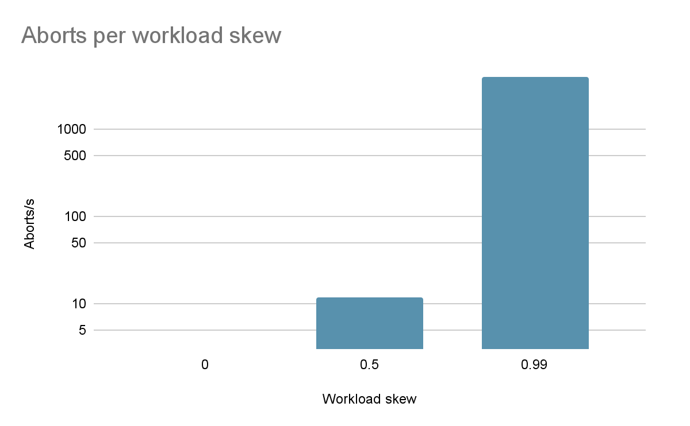
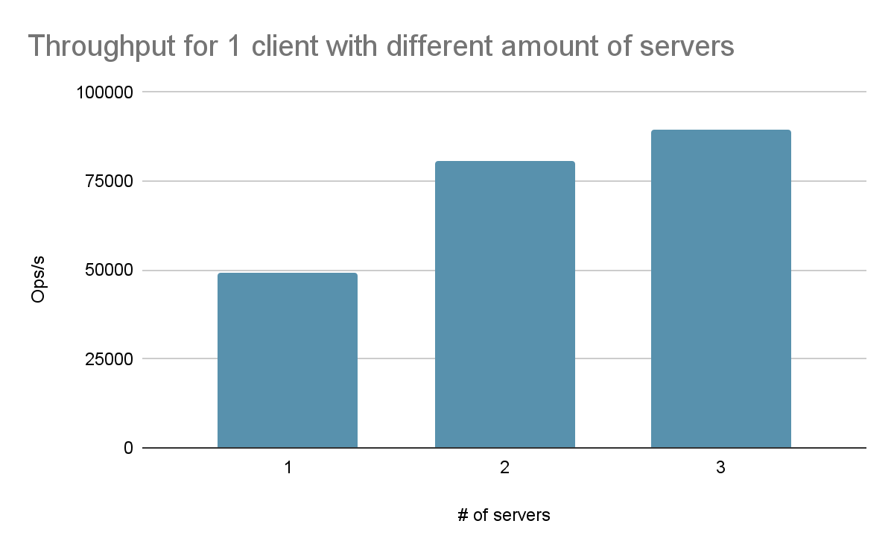

### **RESULTS**

Scaling characteristics:  
Below is a plot showing the scaling characteristics when increasing the ratio of servers to clients.  
  
With 1 client and 2 servers, throughput reaches 80k ops/s, and with 3 servers, throughput is 90k ops/s. This tells us that around 1-2.5 clients per server is an optimal ratio. The solution scales well with multiple clients. Running with 1 client and 1 server gets around 49k ops/s, running with 2 clients and 2 servers gets to around 90k ops/s. Note here that operations are commits/second, meaning the throughput of gets and puts is roughly 3 times the ops/s since each transaction contained 3 operations.  
In order to compare the effects on contention we evaluated the program with different theta values. Below is a chart displaying the number of aborts relative to the theta value when running 1 client to 3 servers.  
  
In this chart, we can see that when using a completely random skew, we get only a handful of aborts. When using a workload skew of .99, we get around 1200 aborts per second, which, if we get around 85k commits/s, means 1 in every 24 transactions aborts. This makes sense as the contention around a key increases, the number of aborts will increase too. We saw this in the bank account workload as the amount of contending keys is even greater than that of the .99 theta workload and had an even greater aborts/commits ratio.

### **DESIGN**

Each client initiates and coordinates transactions by interacting with one or more servers:

* At the beginning of a transaction, the client invokes Begin(), which creates a globally unique transaction ID (TxID) using a UUID. No server communication occurs at this stage. However, UUID generation introduces slight computational overhead and longer payloads. While collisions are practically impossible, at very large scales, UUID-based IDs may become inefficient and add extra latency.  
* Each operation (Get() or Put()) includes the client’s ID and transaction ID. Servers only learn of a transaction when they receive its first request.  
* The client records all participating servers (up to three, based on operation count) and tracks which operations succeeded.  
* If any server responds with a lock denial, the client immediately sends Abort() to all involved servers and retries the entire transaction with a new TxID.

This client-driven coordination keeps the servers stateless with respect to transaction orchestration, simplifying fault tolerance and scalability.  
Our system enforces Two-Phase Locking (2PL) at each server:

* A Get(key) request attempts to acquire a shared (S) lock:  
  * If the key is held by a writer, the request is denied.  
  * If no conflicting lock exists, the transaction is added to the key’s reader set.  
* A Put(key, value) request requires an exclusive (X) lock:  
  * If the transaction already holds a shared lock and is the only reader, it may upgrade to an exclusive lock.  
  * If another transaction holds a conflicting lock (reader or writer), the request is denied.  
* Commit Phase:  
  The client sends Commit() to all participating servers.  
  * Each server:  
    * Applies updates from the transaction’s write-set to its main key-value store.  
    * Releases all locks.  
    * Send back an acknowledgment (ACK).  
* Abort Phase:  
  * If any operation fails during execution, the client sends Abort() to all participating servers.  
  * Each server discards the transaction’s write-set and releases all locks.

This lock protocol ensures conflict serializability by preventing concurrent conflicting operations. The no-wait policy avoids deadlocks: if a lock cannot be granted immediately, the server returns “No,” and the client must abort and retry. By staging writes and only applying them during commit, the system ensures atomicity and durability. All-or-nothing behavior guarantees that a transaction either takes effect completely or leaves no trace.

Each server independently manages:

* A local key-value store: map\[string\]Value  
* A transaction table: map\[uint32\]\*Transaction  
* Shared/Exclusive lock sets per Keys for concurrency control

The Shared/Exclusive lock structure associated with each key contains:

* readers: a set of transaction IDs currently holding shared (S) locks  
* writer: a single transaction ID (or null) holding an exclusive (X) lock

Shared (S) locks allow multiple transactions to read a key at the same time, but block writes. Exclusive (X) locks allow only one transaction to modify a key and block both other readers and writers.

**Baseline Implementation**  
Our baseline implementation separates a transaction into three clear stages:

1. Prepare (Begin): The client generates a transaction ID and resets its local state.  
2. Operation (Get/Put): The client issues Get or Put requests with the transaction ID and waits for acknowledgments from servers.  
3. End (Commit/Abort): Once all operations succeed, the client finalizes the transaction by sending Commit to all involved servers; otherwise, it sends Abort to roll back changes.

**Workload observations and considerations:**  
YCSB-B Workload: 3 operations \+ Commit/Abort  
	Around 4 round-trips per transaction  
Bank Workload: 2 Get() \+ 2 Put() \+ Commit/Abort  
Around 5 round-trips

Due to the no-wait policy, late-stage aborts (e.g., during the last operation) increase wasted work and bandwidth. This is a trade-off we accept for simpler concurrency management and guaranteed deadlock freedom. Servers are unaware of global transaction state and only maintain local metadata for the transactions they are involved in.  
Another trade-off we observed is that if any operation within a transaction fails, especially the last one, the entire transaction must abort and restart. Because every transaction involves multiple dependent operations, aborting late in the sequence wastes bandwidth and increases overall abort rates under high contention. This is an expected result of our no-wait policy, which avoids deadlocks by forcing immediate retries instead of waiting for locks.  
Even with this cost, the design remains simple and robust. It guarantees correctness and isolation, making it well-suited for the bank workload, where reliability is more important than raw throughput. Transactions in such critical systems must always complete correctly, even if that means slightly higher latency. Under Two-Phase Locking (2PL), every Get() and Put() request must first acquire the correct lock on the target key. Once all operations in a transaction succeed, the client begins the Two-Phase Commit (2PC) process. In this phase, the client sends a Commit() request to each server that participated in the transaction. Each server applies the pending updates from its write-set to its main key-value store, releases all locks, and replies with an acknowledgment (ACK). If any operation fails before this point, the client instead sends an Abort() request to all involved servers, causing them to discard any staged changes and release their locks immediately.

#### Serializability Guarantees

By enforcing:

* Per-key fine-grained locking,  
* Strict S/X locking semantics,  
* Immediate aborts on lock conflict (no-wait),  
* Isolation via deferred writes,  
* Atomic commit/abort semantics,

Our system guarantees that the interleaving of transactions is equivalent to some serial execution that respects real-time order, achieving strict serializability.

In order to better test serializability we used the bank account workload, function sets up 10 worker go routines. We initialize 10 keys to represent different bank accounts. Each go routine picks two accounts and a random amount between 0 and 20 dollars to transfer from one account to another. Each account on the server is initialized with 1000 dollars, so in total, there are 10,000 dollars between all accounts. 

| Account Id | Initial Balance | Result Balance |
| :---- | :---- | :---- |
| 0 | 1000 | 357 |
| 1 | 1000 | 3188 |
| 2 | 1000 | 116 |
| 3 | 1000 | 889 |
| 4 | 1000 | 2351 |
| 5 | 1000 | 7 |
| 6 | 1000 | 270 |
| 7 | 1000 | 877 |
| 8 | 1000 | 1649 |
| 9 | 1000 | 296 |
| SUM | 10000 | 10000 |

Here we can see that the balances still sum to 10,000. This workload has very high collisions but helps show that the server code is strictly serializable, as many transactions can happen concurrently, but with a result that is still serializable. 

### **REFLECTION**

While building our transactional key-value store, we explored how different design choices affect both performance and correctness. The main trade-off we observed was between single-shard and multi-shard setups, especially when comparing the banking workload to the YCSB benchmark.  
In the single-shard version, all transactions go through one server. This reduces contention because all operations share a single lock space, so aborts are rare and execution is more predictable. The downside is higher latency; every transaction must pass through the same server, so parallelism is limited. Even though it’s slower, this setup is ideal for banking transactions, where reliability and correctness are far more important than speed. In these systems, users prefer to wait an extra moment rather than risk a failed or inconsistent transfer.

In the multi-shard version, transactions are distributed across multiple servers. This improves throughput and scalability since multiple transactions can run in parallel, but it also increases the chance of aborts. Cross-shard coordination introduces more lock contention, and our no-wait policy means any conflict leads to an immediate abort and retry. Despite that, this approach works much better for key-value workloads like YCSB, where concurrency and speed are more important than absolute transactional latency.

Throughout the project, we also saw how the nuances of 2PL \+ 2PC making it challenging ensure correctness. Servers only handled local locks and writes, while clients coordinated commits across participants. This separation made the system easier to reason about and debug.  
Overall, both approaches, single-shard and multi-shard, are correct under our model but suit different goals. The single-shard design favors consistency and predictability, while the multi-shard design favors scalability and performance. Working on this project helped us understand the balancing correctness, latency, and throughput based on the workload’s needs rather than aiming for a one-size-fits-all solution.

For bank transactions workload collisions were very high, which caused unlikely errors to crop up more often. Some errors we experienced were not properly tying up locking resources after commits and aborts, and frequent deadlock. Deadlock was a pretty common occurrence as both ends of the transaction were in competition with one another. A way around this was making sure the source gets and put happened before the destinations get and put rather than doing a get, get, put, put. This greatly reduced contention around keys.  

### REPRODUCIBILITY

Small changes to [report-tput.py](http://report-tput.py) were also added to be able to print commits and aborts per second for a given run.    
Work under /mnt/nfs so binaries and logs are visible to every node.

1. git clone \-b pa2-turnin git@github.com:Dashree/cs6450-labs.git  
2. cd cs6450-labs  
3. Run the command   
   ./run-cluster.sh 3 1 

### INDIVIDUAL CONTRIBUTION

All worked on the overall design and tried implementing it to find out different aspects of the code. We each worked on our initial design solutions individually, but ended up merging Jacob’s and Shreeda’s. Fariba and Sumaiya wrote most of the report. Jacob generated results. While Shreeda helped with the design’s salient features.

#### **DISCLAIMERS**

Copilot was enabled during the writing of most of the code. Also made use of ChatGPT to debug tricky race conditions. Code design is our own.

[image1]: <data:image/png;base64,iVBORw0KGgoAAAANSUhEUgAAAd4AAAEnCAYAAAAHAyISAAAflUlEQVR4Xu3dbaxcVfXH8VuglZa0tqDVWDWkPrxQ4YWEBqIvUGINkaSGmCBqTAgSJYYEQxREoIhWjOITPmDQPl0RtQWNtihoqIbUJtBiW5RWfMBYFWlpC0UsbW17/v91kn3c85uz5t6Wuad7b7+f5JeZs86ZmdWZfc+6d+5cGKkAAEBnRrQAAAAmDoMXAIAOMXgBAOgQgxcAgA4xeAEA6BCDFwCADjF4AQDoEIMXAIAOMXgBAOgQgxcAgA4xeAEA6BCDFwCADjF4AQDoEIMXAIAOMXgBAOgQgxcAgA4xeAEA6NDzGrwf/ehHx0x8XKpS6u2f//xn9YUvfKG6/vrrq82bN+vuobj55puH8m/O6TU2g/obZv/x/bTdp72+V199dfP6dvGaH4l9+/ZpCS1Se92QDwZv1X5yHLbxPgd2zBe/+MUJO/k9+eST4+5lLBP9Gk/k/Wm/uv186P3Gwuv73HPP9dUm6jU/EsN8HlI1rH9fSq8b8vK8Bq/yFnTqX8xd9Dbe58COOXDggJaHYuPGjU0f4+llLMO6H89E33d8/7r9fAy6n7bXt612rAzzeUjVsP59Kb1uyEung/eJJ56o3+b8/Oc/X/3pT3/q279z587quuuuq37+8583+w4fPlzddNNN1Sc+8Ym+t3O8k4TW/v3vf1df/epX6/vZtm1b3+3C9Z/85Cf143//+99v9sX77a2lj3/84/V9KX3MuBYeL47S/fEx43kO2p47ZccdPHiw7/7H8t3vfrf+d3/nO9+pewni+2m7z61bt1af+9znqs985jPVhg0bevbFx9tPDXb/jzzySN/+tvuN98f+85//1G/hxr7yla/09BguvRhbB9dee23fOvDcf//99ePefvvt9Xbcl14fKzF77q655hr3ufNe87FuZ+6+++76OQ89x/vbelGrV6+uFi1aVN1www3VypUrdXdz+5/+9Kf1c/nLX/6y2fe9732vfntW+za2vmy92Vq3S9XWV1wLvdu5ZuHChfXa033j/TfGfbSt+/Hcjz3PtjY++9nP1uehNmO9XvY6h+fLtu0b6Fj4hjq2YsWKem0sX768/pqPhWOXLVtWffnLX27q4+kVw9Hp4NV4+x966KG6/uijj/btsy8EvZ3Smt6H3s6u33HHHQP3//a3v3X3h2NUqOntvGM1ZrzPQUh47gbxemhz1VVX9T1GEG/rvvgbnJD4mwbdF/L1r3+9db+yk4bWbVBqLb59fDne2OMM8rGPfazn+B/84AfN4xi9PlZM23MXf0Oh+8JrfqS3Cxnvcx7YfeqxNuRiVtN3WOwbLL2dvk2r++O1HvaruKa3D7HBqbW2+wrsmxLvWK1796PHWH784x83+4/09bLX2S7tG5mYbcc92DdDetuYbS9ZsqRnnx5viXvFcHU6eLVmP/16+0M9/sJ7+umn65r95Bn2e7cL7MTY9sUbH2PX4+/8fvOb3/Ttt/uJtd2H0v1txyg9xraP5jkYZLy3aTvOtm246P74+p49e/puZ6z217/+tbmux2hN9yvbb98QxduW2267racWhqfed9t2/JONrgO1e/fuen/800E4YQd6e91uq9n2t771rb7aoOcu1I/0dps2berrV4+J2btVuv+pp57qq9n2Lbfc0rPddsyNN97Ysz2er1Wl+/UY29affAdpuw/rS2u6rWz//v37e7a11yN9vbQWvqHYtWtXvR2+KYrZT+z6uPbuVWysXjFcx3Tw2k9T3v5Qj99+DLVwYh10u/j6li1bor39t7Pr27dvb7bD27Hxfu9toHhb6f62Y5QeY9tH8xwMMt7bjHVcvD++Pjo62no7q33jG99orusxWtP9yk4y4SetP/7xj/Xx8Se2w+sYPsik9z1o2+g6UEuXLu3b3zbIYrrdVrNtfavPaoOeu1A/0tvZ2/Parx4ziH1ttQ1j23788cd7ttuO0cduW+t6jNL9eoxth3NN2B6k7T6sL63ptgqPq2/1Brb/SF+vNWvW9NTsLf+x/v32GHrM3//+9+iIsXvFcB3TwRtqbftD/dChQ3218Qzs+Hr8U0yo6TFK97f1occo3d92jNJjvMce6zkYZLy3Geu4eH98ve3t6ZDwzkHbfWtN96tnn3225/Htp5p4kHzqU5/qe+suvj5oO657wr8zZq+V3m9Mt9tqoRfNoOcurmvGc7v4etsxsfitZvtGJ7xlGmvbHqtm19vWuh6jdL8eozXdr/R4o6+r0W1lA++Tn/xkc38W+/xAENfjjOf1uueee5rr8TF6X3HiY9RYvWK4kh+84S2UuBbeNmq7nf10o4us7T70GKX77e20WNt9xAO+rY+2x1F6jNf/oOdgLOO9zVjHxfvj69bboNuZtvvWmu5vY8f86le/qi/DOxt23T5tapcPPPBAz7Hx9UHbcd1jH3jT/eFXAYHu1+22mm3bh4M8g3o92tvF19uOCezDUrY//nrYu3dv323atseq2fW2ta7HHOnXmdZ0v9LjTfgzvJhuD/LrX/+6737t+tG8XvbhzlC3y1tvvbXZ590mNtb+tl4xXMkP3vh3PuF3h+F3IG0nPvtdbVyzn0rsE4ExfTy9D63Z9bYPj9jv8+Lt+O3otj7aHkfpMWM9B/pvGY/x3qbtONsOH+aJ98fX7WRi19vezop/39p233HNruu7FSrcJr7dvffeW78V33b/gb4eeh9x3RN+txkPC1sner8x3W6r2XbbZwoGPXehfrS3C/R5UW2/67R3FqymvyOMtT221uz6eH7HO+jrTI9vq9n1QetKjzdt/27dVrbfvikM/vWvf/X1cTSvl7G6fX3p/rbb2Ica9XHVWL1iuJIevGGx208y9ulHPe53v/tdvW1/MmLfdX/zm9+sP6wRHxMGlR1j3x2HL9T4mLbH1v0W+7CI3Uf4nVb8+5lwjPVhf0ajfdhH9G3bFvRjjz3W1JX2MtZzoNvjMd7b2Ae47Dj7na29hasnn/h+9D7tTxls237itD+HCJ+0DPT4tppdtz89GfS3kl/72tfq4+ybsCD+BGss3tbXo+1401aLhdvZurBPoOvg0tvrdlstfu7seR/Pc2eO9nZxLX5e2vziF7+o99vvFu11sT+FCfe7Y8eO5jh9nLbH1lr4qfJLX/pSvdbt0rb/8Y9/9N3G+zrT+2yr2XVbV97XYdyHva5tfRh9HBUe1z6EF96BiW9ztK+XCfvi310b+ybQ6vbNkL2G4d0g+xRz0HafY/WK4Up68Br73YqdVO2ny4cfflh31+ytTVu09sVo9L7si8fejvn0pz9d/eUvf+l7PD1ea+G6fXAm/ntNZZ8etD7s7zqN3q/9zsS+UOybAI/exgx6DvTfMh5Hehv7EJE9tv7OZ6zX0D6QYidm+ylw1apVPfvajteafdNkfyphz+kgdhsdzlYLH1KJa7H49dDHDtpqyk6cti7sGxQT30Zvr9tezb55sOfO+hvPcxccze20Zt9Y6gk9Zl9P9i6SDb3wzafdR/grhbAda3vstpqtdfv60r8xjg36Omu7T62Fv9Me9HVo7PHt72vtsu0nZH2cNn/4wx/q9W/Pl/79rTma18uEb/DCOU/ZXx7YY9oPC/GH3Ix3n2P1iuEZ6uBNkS0y+xCO1rzF1+ZIjgUAYJD/icFrsb/JtO8Ow39kIf59xlgYvACAYSl+8JowfEPiT7qOB4MXADAs/xODFwCAVDB4AQDoEIMXAIAOMXgBAOgQgxcAgA4xeAEA6BCDFwCADjF4AQDoEIMXAIAOMXgBAOgQgxcAgA4xeAEA6BCDFwCADmU1eEdG/tvukiVL6m3L4sWL+2qTJk1qjm2r2fVQb6uF+wQAYJiyGLzTp0+vTj311J4h2XY9rt1666315Qc/+MGe2oc//OG6tmzZsqZuNRPX4vsCAGBYspguO3furC/bhm18Pa5t3769vpwzZ05Pbfbs2XUt3KexmolrDF4AwETIarq0Ddv4elzbu3dvfTlt2rSe2owZM+rac88919StZuIagxcAMBGymi5twza+HteWLl1aX1566aU9tcsuu6yujY6ONnWrmbjG4AUATISspks8DGfNmlVt3bq1zsyZM5vae97znroWjn322Wfr2oEDB+raM888U9fsutUuvPDCuhbu325rtXCfAAAMU1aDFwCA3DF4AQDoEIMXAIAOMXgBAOgQgxcAgA4xeAEA6BCDFwCADjF4AQDoEIMXAIAOMXgBAOgQgxcAgA4xeAEA6BCDFwCADjF4AQDoEIMXAIAOMXgBAOgQgxcAgA4xeAGgQx/69t3Vu79yF3Fiz8+uf+3Vp60oDF4A6MhlDN1xp2QMXgDoiA4X4qdkDF4A6IgOF+KnZAxeAOiIDhfip2QMXgDoiA4X4qdkDF4A6IgOF+KnZAxeAOiIDhfip2QMXgDoiA4X4qdkDF4A6IgOF+KnZAxeAOiIDhfip2QMXgDoiA4X4qdkDF4A6IgOF+KnZAxeAOiIDhfip2QMXgDoiA4X4qdkDF4A6IgOF+KnZAxeAOiIDhfip2QMXiBxekIi7cnhf56uPRM/JWPwAonTExLxkzrtl/gpGYMXSJyekIif1Gm/xE/JGLxA4vSERPykTvslfkrG4AUSpyck4id12i/xUzIGL5A4PSERP6nTfomfkjF4gcTpCYn4SZ32S/yULNvBOzIy0hOzYsWKvlp87KRJk5qaXdfj4trixYubOnAs6QmJ+Emd9kv8lCzbwRu75JJL6suzzjqrWr9+fc++5cuXN9fPOOOMatWqVXXtvPPOq2sHDx6sayauxQMZOJb0hET8pE77JX5Klv10mTlzZnM9/ml3ypQpdW3OnDnN/u3bt1ezZ8+uazt37mzqVjNxjcGLVOgJifhJnfZL/JQs6+myb9++atq0ac12PCwXLVpUXx533HFN7dChQ/W25fDhw009HBPXvMG7YcMGQjqNnpCIH33uUov2S/zoc5dano/26ZKJE088sR6+bXbv3l1fnn322U1t48aN1bx58+ra5s2bm7rVTFzzBi/QNT0hET+p036Jn5JlPV10OMbbV155ZX25cuXKpnbOOedUo6Ojde3cc89t6lYzcU3vGzhW9IRE/KRO+yV+Spb1dGkbjvYBqblz51Y7duxoavPnz68mT55c3XfffU3trrvuqmsLFizoqZ188sk9NeBY0xMS8ZM67Zf4KVn/5AKQFD0hET+p036Jn5IxeIHE6QmJ+Emd9kv8lIzBCyROT0jET+q0X+KnZAxeIHF6QiJ+Uqf9Ej8lY/ACidMTEvGTOu2X+CkZgxdInJ6QiJ/Uab/ET8kYvEDi9IRE/KRO+yV+SsbgBRKnJyTiJ3XaL/FTMgYvkDg9IRE/qdN+iZ+SMXiBxOkJifhJnfZL/JSMwQskTk9IxE/qtF/ip2QMXiBxekIiflKn/RI/JWPwAonTExLxkzrtl/gpGYMXSJyekIif1Gm/xE/JGLxA4vSERPykTvslfkrG4AUSpyck4id12i/xUzIGL5A4PSERP6nTfomfkjF4gcTpCYn4SZ32S/yUjMELJE5PSMRP6rRf4qdkDF4gcXpCIn5Sp/0SPyVj8AKJ0xMS8ZM67Zf4KRmDF0icnpCIn9Rpv8RPyRi8QOL0hET8pE77JX5KxuAFEqcnJOInddov8VMyBi+QOD0hET+p036Jn5IxeIHE6QmJ+Emd9kv8lIzBCyROT0jET+q0X+KnZAxeIHF6QiJ+Uqf9Ej8lY/ACidMTEvGTOu2X+CkZgxdInJ6QiJ/Uab/ET8kYvEDi9IRE/KRO+yV+SsbgBRKnJyTiJ3XaL/FTMgYvkDg9IRE/qdN+iZ+SMXiBxOkJifhJnfZL/JSMwQskTk9IxE/qtF/ip2QMXiBxekIiflKn/RI/JWPwAonTExLxkzrtl/gp2dAG7zPPPFONjIxU+/btqy8tTz31lB4G4AjpCYn4SZ32S/yUbGiDd8aMGdWePXuql7/85dUll1xS7d27t5o6daoeBuAI6QmJ+Emd9kv8lGxog/f1r399tWXLlvon3W3btlWrV6+u3vCGN+hhAI6QnpCIn9Rpv8RPyYY2eM2b3vSmatmyZfX1G264QfYO19/+9rfmLW1L8M53vrOaM2dOtW7dup7alClTempr1qypaxdddFFPzW4b14BjTU9IxE/qtF/ip2RDGbyXX365libcRz7yES1VM2fOrN773vc2P3kbe/vbavv3769rdmm1cP2CCy6oL43V7LZWmzVrVnzXwDGjJyTiJ3XaL/FTsqEMXnPnnXdWL3nJS+rh9f73v193D509zumnn1696EUv6qkFDz30UH155pln9tRs27Jp06amHo6Ja/F9AceSnpCIn9Rpv8RPySZkuixevLjvLeBhs/t+8skn698nn3jiiU0tsA93menTp/fU7O1lq4Wfco3VTFybyN6BI6EnJOInddov8VOyoU6X8JbzO97xjup973uf7J04YUjGw9KGsnnpS1/aU7NPXVtt165dTd1qJq55g3fDhg2EdBo9IRE/+tylFu2X+NHnLrU8H+3T5SjceOON1Wtf+9pq5cqV9dB661vfWl199dV62NDEg7Ft8C5durS+vPTSS3tql112WV0bHR1t6lYzcc0bvEDX9IRE/KRO+yV+Sja06XLSSSfVb+XawLIBZz89Tps2TQ8bmptuuql5O/uRRx6pazfffHNTmzRpUnPsoJoO8JAlS5Y09Zzc8rMH+xYwaU8utG/iJ3XaL/FTsqEN3g984APVxRdf3AyyV7/61dW1114rR2Gi6eIlfnKhfRM/qdN+iZ+SDW3wIg26eImfXGjfxE/qtF/ip2RDHbynnHJK81bt6173Ot2NDujiJX5yoX0TP6nTfomfkg1t8Np/pGLBggXN9tvf/vZq4cKF/z0AndDFS/zkQvsmflKn/RI/JRva4D3ttNOqBx98sNneunVr9eY3vzk6Al3QxUv85EL7Jn5Sp/0SPyUb2uA1kydPrp544onq6aef7vm0MLqji5f4yYX2TfykTvslfkrGdCyMLl7iJxfaN/GTOu2X+CkZg7cwuniJn1xo38RP6rRf4qdkQxm8hw4dqk444YTq3nvvrf+zjB/60Ieq+fPn62HogC5e4icX2jfxkzrtl/gp2VAG7/HHH6+lehA/9thjWsYE08VL/ORC+yZ+Uqf9Ej8lG8rgbfsg1Y4dO/h/2h4DuniJn1xo38RP6rRf4qdk/RPzKLQNXnvL2f7H9OiWLl7iJxfaN/GTOu2X+ClZ/8Q8CrzVnA5dvMRPLrRv4id12i/xU7KhDN4DBw7U/yeiNWvW1H/De8UVV1Tnn3++HoYO6OIlfnKhfRM/qdN+iZ+SDWXwIh26eImfXGjfxE/qtF/ip2QM3sLo4iV+cqF9Ez+p036Jn5IxeAuji5f4yYX2TfykTvslfkrG4C2MLl7iJxfaN/GTOu2X+CkZg7cwuniJn1xo38RP6rRf4qdkDN7C6OIlfnKhfRM/qdN+iZ+SMXgLo4uX+MmF9k38pE77JX5KxuAtjC5e4icX2jfxkzrtl/gpGYO3MLp4iZ9caN/ET+q0X+KnZAzewujiJX5yoX0TP6nTfomfkjF4C6OLl/jJhfZN/KRO+yV+SsbgLYwuXuInF9o38ZM67Zf4KRmDtzC6eImfXGjfxE/qtF/ip2QM3sLo4iV+cqF9Ez+p036Jn5IxeAuji5f4yYX2TfykTvslfkrG4C2MLl7iJxfaN/GTOu2X+CkZg7cwuniJn1xo38RP6rRf4qdkDN7C6OIlfnKhfRM/qdN+iZ+SMXgLo4uX+MmF9k38pE77JX5KxuAtjC5e4icX2jfxkzrtl/gpGYO3MLp4iZ9caN/ET+q0X+KnZAzewujiJX5yoX0TP6nTfomfkjF4C6OLl/jJhfZN/KRO+yV+SsbgLYwuXuInF9o38ZM67Zf4KRmDtzC6eImfXGjfxE/qtF/ip2QM3sLo4iV+cqF9Ez+p036Jn5IxeAuji5f4yYX2TfykTvslfkqW7eC97rrrqpGRkToXX3xxXVuxYkVTswRhe9KkSU3NrutxcW3x4sVNPSe6eImfXGjfxE/qtF/ip2TZDl4drOass86q1q9f39TN8uXLm+tnnHFGtWrVqrp23nnn1bWDBw/WNRPX4vvPiS5e4icX2jfxkzrtl/gpWZ7TRYQhGf+0O2XKlLo2Z86c5rjt27dXs2fPrms7d+5s6lYzcY3BW35yoX0TP6nTfomfkuU5XSIHDhyo1q5dW1+Ph+WiRYvqy+OOO66pHTp0qN62HD58uKmHY+KaN3g3bNiQdHTxEj/63KUa7Zv40ecutWi/xI8+d6nl+WifLpk499xzq+uvv17Ltd27d9eXZ599dlPbuHFjNW/evLq2efPmpm41E9e8wZs6XbzETy60b+Inddov8VOyPKfL/1u9enX1ox/9qKcWD8srr7yyvly5cmVTO+ecc6rR0dG6ZkM7sJqJawze8pML7Zv4SZ32S/yULM/pUvX+PjcekvYBqblz51Y7duxoavPnz68mT55c3XfffU3trrvuqmsLFizoqZ188sk9tdzo4iV+cqF9Ez+p036Jn5JlO3jRThcv8ZML7Zv4SZ32S/yUjMFbGF28xE8utG/iJ3XaL/FTMgZvYXTxEj+50L6Jn9Rpv8RPyRi8hdHFS/zkQvsmflKn/RI/JWPwFkYXL/GTC+2b+Emd9kv8lIzBWxhdvMRPLrRv4id12i/xUzIGb2F08RI/udC+iZ/Uab/ET8kYvIXRxUv85EL7Jn5Sp/0SPyVj8BZGFy/xkwvtm/hJnfZL/JSMwVsYXbzETy60b+Inddov8VMyBm9hdPESP7nQvomf1Gm/xE/JGLyF0cVL/ORC+yZ+Uqf9Ej8lY/AWRhcv8ZML7Zv4SZ32S/yUjMFbGF28xE8utG/iJ3XaL/FTMgZvYXTxEj+50L6Jn9Rpv8RPyRi8hdHFS/zkQvsmflKn/RI/JWPwFkYXL/GTC+2b+Emd9kv8lIzBWxhdvMRPLrRv4id12i/xUzIGb2F08RI/udC+iZ/Uab/ET8kYvIXRxUv85EL7Jn5Sp/0SPyVj8BZGFy/xkwvtm/hJnfZL/JSMwVsYXbzETy60b+Inddov8VMyBm9hdPESP7nQvomf1Gm/xE/JGLyF0cVL/ORC+yZ+Uqf9Ej8lY/AWRhcv8ZML7Zv4SZ32S/yUjMFbGF28xE8utG/iJ3XaL/FTMgZvYXTxEj+50L6Jn9Rpv8RPyRi8hdHFS/zkQvsmflKn/RI/JWPwFkYXL/GTC+2b+Emd9kv8lIzBWxhdvMRPLrRv4id12i/xUzIGb2F08RI/udC+iZ/Uab/ET8kYvIXRxUv85EL7Jn5Sp/0SPyVj8BZGFy/xkwvtm/hJnfZL/JSMwVsYXbzETy60b+Inddov8VMyBm9hdPESP7nQvomf1Gm/xE/JGLyF0cVL/ORC+yZ+Uqf9Ej8lY/AWRhcv8ZML7Zv4SZ32S/yUjMFbGF28xE8utG/iJ3XaL/FTMgZvYXTxEj+50L6Jn9Rpv8RPyRi8hdHFS/zkQvsmflKn/RI/JWPwRtasWVPNmTOnuuiii3RXNnTxEj+50L6Jn9Rpv8RPyRi8kZGRkWrLli3VBRdcUM2aNUt3Z0EXL/GTC+2b+Emd9kv8lIzBG9m0aVNz3YZwjnTxEj+50L6Jn9Rpv8RPyfKcLhNk//79zXUGb/nJhfZN/KRO+yV+SpbndJkgu3btaq7nOngBAGljukRGR0eb6wxeAMBEYLpEbNiGLFmyRHcDAPC8MXgBAOgQgxcAgA4xeAEA6BCDFwCADjF4MeG+/e1v8ynxQpxwwgnVo48+Wl111VW8ppm75ZZbqjvvvLPas2cPr2XHeLYx4U499VS+sAvx+OOPN9d5TcvBa9ktnm10gi/ssthPSSeddJKWkSH72ly7dq2WMYE4G6ITDN6yvOxlL9MSMjZz5szqnnvu0TImCGdDdILBW4Z169ZVkyZN0jIy9OIXv7i5vm3btmz/j2w54myITjB4y/DCF75QS8jUgw8+WP8X+g4ePFhNnTq1euCBB/QQTBDOhgAAdIjBCwBAhxi8AAB0iMELAECHGLwAAHSIwQsAQIcYvAAAdIjBCwBAhxi8AAB0iMELAECHGLwAAHSIwQsAQIcYvAAAdIjBCwBAhxi8AAB0iMELAECHGLwAAHSIwQsAQIcYvAAAdIjBCxTqlFNOqS9f+cpXyp5273rXu6oXvOAFWgYwZAxeoFDr1q2rLx9++GHZ025khNMB0AW+0oDC2ADVqKlTp/bs846dPn16U3/Na15T1+6///6mdvfdd9c1u/62t72tuvDCC3vuI1yfMWNG620sdpu2xwFK1f8VCSB74S3jKVOmyJ6qOvPMM6uf/exnzfYb3/jG+lKHbqjdfvvtfTW9bpe///3v6+tXXHFFs//yyy+vL//85z83tfg2cU0fByhV/1cagOy1Dbfg+OOPrw4ePNhsT548ub5sO/aHP/xh85Poq171qroWtkNCLWY/Fa9fv77ZHus2bY8DlKr/Kw1A1jZt2lTNnTu3Wrt2bXX66afr7uqaa66p3vKWt9TXDx06VC1cuLC+rsNTa20Ds60WtuPaaaed1rMvvhx0HSgRKxwozLvf/e7qtttuq84///zqjjvu0N01eytah2PbwLO3ocNxr3jFK+qa/Y421JYvX17X9Lbz5s3rGbbx75TbbtP2OECp+r/SAADAhGHwAgDQIQYvAAAdYvACANAhBi8AAB1i8AIA0CEGLwAAHWLwAgDQIQYvAAAdYvACANAhBi8AAB1i8AIA0CEGLwAAHWLwAgDQIQYvAAAdYvACANAhBi8AAB36P5B0ucH37wuPAAAAAElFTkSuQmCC>

[image2]: <data:image/png;base64,iVBORw0KGgoAAAANSUhEUgAAAf8AAAE8CAYAAADOjbikAAAbH0lEQVR4Xu3de4wWV/3H8eUurSCshDRsQ623pJr4h7UoxkQaEqOJDbEx9mf8wz+sIQ0xxBjsVesNWy2hF002P40UsV5apCbl8rPY1bZGAu3iQihLa6y1WCu0W3RpWe6c3++c5szvPN+dZ/lQBvbMzvuVfPLMnJmdmX2mz3ye29IOBwAAGqXDDgAAgLGN8gcAoGEofwAAGobyBwCgYSh/AAAahvIHAKBhKH8AABqG8gcAoGEofwAAGobyBwCgYSh/AAAahvIHAKBhKH8AABqG8gcAoGEofwAAGobyBwCgYSh/AAAahvIHAKBhKH8AABqm8vJftmxZkTIjLavK8uXLz/k+6k45D6dbXrWz3Z/yOwEAKi7/v/71r+Hi+8wzz7S9CJ+PC/T52EfdKffR6ZZX7Wz3p/xOAICKy/+WW25x69atC9P+Irx//36zxvm5QJ+PfdSdch+dbnnVznZ/yu8EAKiw/A8ePNhy4X3llVdKL8TxAv3rX/+6mC5bz1uxYkXLOi+88ELL8nSZz6pVq4aNeb/61a+Gjf/hD39o2ZYV17vhhhuK6a997Wt2Nffyyy8P2/azzz7bso4fGxwcbDkmy49/9atfHTZm1//Pf/4Txo4ePRrm/X1i9192P9n9220/99xzYf76668vxuy+y/Zl/e1vfxu2zve//327mvvmN7/Zss6JEydKt5ey59GeD3tMZb+TZ48vni9/n/r5N3IeAKBOKiv/lStXDrtA+vl9+/YNG4vZsWOH27NnT5i+8cYbW9bzF3Y/3t/f7w4fPlxs/8CBA8U6cTt+nZdeeskdOXKkZTxdz2/P/+zzzz8/bHmZuM63vvUtd+jQoeI42xWJ/8hj7969oTjsttPj3LhxY8uyqOyY4pjff/SjH/1o2O8Wt+0z0nZ8UcX9p+s9+eSTbX8u8u/ixHX8+Yj7+vrXv16s89prr4Wxn/zkJ+GY/f78/eXH0t/7xRdfDGM//OEPwzrf+973Svef2rJlS1j+pz/9KTxRKDuPZb+TfYLw7W9/O4z78+X3Hc/Xv/71r7DcbjMdG+k8AECdVFb+7S6aaTnEMR9f1lF8VepfRXv+Quznb7755mIdz+7Dzrcb99PpK7RYZCOx2/D88fixgYGBMB+P2/JjvpzS+Z/97GfJGsPFdy1S8Rh80aRjq1evDtPxfvLHEcVXpLHMvLL9x22fOnWqmI6/V7pOOn26fd1xxx3Dfod///vfYcx/JBT5+VtvvfX/V/o//smf/dlUvO9T8Zjs/IYNG4Yt80Y6X3H8jZwHAKibSsr/l7/8ZXGBLIstIntxjePf/e53w/Ttt98e5v1HB3ad9GftfLvx9Fj8K0KF3YYXP8rwH0d46StWm+985zvFz/n5V199tZhvx68X34L235147LHH3G9+85viOJ5++umWY4r3k+XH4n0Z5+3+7fGWScfbrWf35T3++OPhVX27ffjp9B0cz79DVLb9KD7R8fFPJMrOY7v9RSOdL3t8Z3IeAKBuKil/exG1Sd96tRfadNx/vu7Ft4pPnjw5bJ30Z+18u3H/dq39jPmmm25KfmI4uw3PH48fi2/9x+MsS/q5sd1OO357t912W5iOP3P8+PFiOr5lna5ftu30GOO8ZY/X/3mklf5cXM+y+0q/I+HvA/9RiP1ZP23PbbxvR+LPoz3uhx56qFgex/yTEX9rf6eRzle67zM9DwBQN5WVv/2SVGQ/A7cX2nTcv23sxYt3Va/8U/4z41gCjzzyiF1cKNtG/HJffOUfj/N0lHW8+Lm2Z3/PY8eODTumdvv3Y/aVv5VuK077V7R2nXS63XbivjZt2hTm/Vv90dDQ0LCf9dP2I4b4EYLKn8e43Xgey36nVLv7yzrT8wAAdXPW5R+/AR6/bGf5cb88fuYeL5y+FCL/+b8fi29Nx7eAq/zM/9FHH03WeH3Mf5mvHbsNz79b4MfiF7/icZZ9uz79PNhuZyR+3fiZdfTwww8XXzDbunVrMR73n34OHz/Xtt85sOzvZ+fjWDp9un2VfS4fXyWn4/4Jof2Cp/8OgP3ZVPxoKeX/e/Fj8Tza/dj5kc6X3bafV88DANTNWZd/fDt9JH753XffXUzH/OUvfwnf+PfTviRSsUj8t8r9E4g777wzzP/zn/8s1im7aKfj/lVaOu9f0fmx+++/P8z7b523E3/mnnvuCU9cdu3aFebTz/LT9bZt2xZezX7jG98Ydkx2fiRxe/FtZy/9Up4Vx/39FP8iwa5n5+NYOh7fUv/FL37Rsk6U/kmj/7Z/2V9p/O53vwtjvjT9/ezvk/gz6bbiq3z/Gbzflv9vo91HGCm/3P/35r8vkL4Cj+fR7qfsd4p/ReKPzb+VH8+X/6JfKm5LPQ8AUCdnXf7+Qrh+/Xo73MIvjxfMePGMbxGPdDGN3x6PSV/Neu1+Nl7Q4zJfyul2fOyX1Cy7vo//EptV9rfvadl4ZcfYTtyGL1c7XvbRyt///vdh+y+7n6y4biq+uvZ/shfXSZXty4r/tHK6vGxd++W7WKwjKTuPu3fvLpaX7SeOxd8pHYux5ytdRz0PAFAnZ13+Y1VZkQAAMBZQ/m1Q/gCAsYryb4PyBwCMVZQ/AAANQ/kDANAwlD8AAA1D+QMA0DCUPwAADUP5AwDQMJQ/AAANQ/kDANAwlD8AAA1D+QMA0DCUPwAADUP5AwDQMJQ/AAANQ/kDANAwlD8AAA1D+QMA0DCUPwAADUP5AwDQMJQ/AAANQ/kDANAwlD8AAA1D+QMA0DCUPwBk5Nr/Xu/+6+515Azj7zfoKH8AyIgtNaIHOsofADJiC43ogY7yB4CM2EIjeqCj/AEgI7bQiB7oKH8AyIgtNKIHOsofADJiC43ogY7yB4CM2EIjeqCj/AEgI7bQiB7oKH8AyIgtNKIHOsofADJiC43ogY7yB4CM2EIjeqCj/AEgI7bQiB7oKH8AyIgtNKIHOsofADJiC43ogY7yB4CM2EIjeqCj/AEgI7bQiB7oKH8AyIgtNKIHOsofADJiC43ogY7yB4CM2EIjeqCj/AEgI7bQiB7oKH8AyIgtNKIHOsofADJiC43ogY7yB4CM2EIjeqCj/AEgI7bQiB7oKH8AyIgtNKIHOsofADJiC43ogY7yB4CM2EIjeqCj/AEgI7bQiB7oKH8AyIgtNKIHOsofADJiC43ogY7yB4CM2EIjeqCj/AEgI7bQiB7oKH8AyIgtNKIHOsofADJiC43oga525f/zn//cdXT8/2GvWrUqzPuMGzeuGPfTcfx06wJALmyhET3Q1ar8P//5z7upU6e2FHo6ffnll4fbn/70p+4Tn/hEmD5x4oRbv35923UBICe20Ige6GpV/tdff324bVf+27dvD7dXXHGF27FjRzHu572ydQEgJ7bQiB7oalX+UbvyP3nyZLgdP368O3XqVDHu572ydcv09vYSQsioxBYa0WPvy1yTgzFV/i+//HK4veiii9wrr7xSjF988cXhtmxdAMiJLTSiB7oxVf733ntvuP3iF7/o1qxZU4xfd9114bZsXQDIiS00oge62pf/ihUrwrxP+g3+OKasCwC5sIVG9EBXy/IHgLHKFhrRAx3lDwAZsYVG9EBH+QNARmyhET3QUf4AkBFbaEQPdJQ/AGTEFhrRAx3lDwAZsYVG9EBH+QNARmyhET3QUf4AkBFbaEQPdJQ/AGTEFhrRAx3lDwAZsYVG9EBH+QNARmyhET3QUf4AkBFbaEQPdJQ/AGTEFhrRA13ty//LX/6yHXKDg4Ph/9x39OhRd/XVV4dbb8aMGa6/vz8k/b/9AUAubKERPdDVvgGnTJlih9zixYvd6tWri/klS5aE27Twu7u7i2kAyIUtNKIHutqXvy/0mMmTJ4exrq4uNzAwUKwze/bsYt1o//79xTQA5MIWGtEDXe3LP/XMM8+E2wsuuMAdPny4GJ8+fXq4Tct/aGiomLZ6e3sJIWRUYguN6LH3Za7JwZgq/wMHDoTb+fPnu507dxbj8+bNC7dp+ff19RXTAJALW2hED3S1L/+00L/yla+E27Vr17qFCxcW42vWrAm36boLFiwopgEgF7bQiB7oal/+3syZM93b3/5299JLLxVj69atc5MmTXKLFi1K1nSus7PTzZkzx/X09LSMA0AObKERPdCNifIHgLHCFhrRAx3lDwAZsYVG9EBH+QNARmyhET3QUf4AkBFbaEQPdJQ/AGTEFhrRAx3lDwAZsYVG9EBH+QNARmyhET3QUf4AkBFbaEQPdJQ/AGTEFhrRAx3lDwAZsYVG9EBH+QNARmyhET3QUf4AkBFbaEQPdJQ/AGTEFhrRAx3lDwAZsYVG9EBH+QNARmyhET3QUf4AkBFbaEQPdJQ/AGTEFhrRAx3lDwAZsYVG9EBH+QNARmyhET3QUf4AkBFbaEQPdJQ/AGTEFhrRAx3lDwAZsYVG9EBH+QNARmyhET3QUf4AkBFbaEQPdJQ/AGTEFhrRAx3lDwAZsYVG9EBH+QNARmyhET3QUf4AkBFbaEQPdJQ/AGTEFhrRA13l5d/R8fomL7300jA9d+5cswYAoB1baEQPdJWX/+DgYLiNTwLiLQDg9GyhET3QVd7M/f397r777qP8AeANsIVG9EBXeTP7svd58MEHw+0HPvABuwoAoA1baEQPdJWV/5e+9CV35MgROwwAOAO20Ige6Cor/5UrV7pJkyaFV/u33HKLO3nypF0FAHAattCIHugqK//o1KlT7tZbb3Xjxo1zEydOdHfccYddBQDQhi00oge6yssfAPDG2UIjeqCrvPz5O38AeONsoRE90FVe/g8//HC4Pd9/6uc/ZrDz8S8PolWrVhVjdn0AyIEtNKIHusqbeTT+zv9tb3tby34WL17sVq9eXcwvWbIk3KbrdHd3F9MAkAtbaEQPdJU382j9nX9a7F1dXW5gYKCYnz17drhN19m/f38xDQC5sIVG9EBXefmPlrTYx48fH/7qIJ330nVG+lPE3t5eQggZldhCI3rsfZlrcnBOy//EiRPn5W1/L93P/Pnz3c6dO4v5efPmhdt0nb6+vmIaAHJhC43oga6yZo5v96fxX6pbsGCBXfWcSIt97dq1buHChcX8mjVrwm26zvk6LgA4E7bQiB7oKiv/0WbfYUifhEQrVqxoeWICALmxhUb0QFd5+e/atcsOAQBEttCIHugqL3/71r99RQ4AaM8WGtEDHc0MABmxhUb0QFd5+b/44ovu/e9/v5swYYJbtmyZXQwAGIEtNKIHusrL37/N/9vf/tYdP37cffSjH3XTpk2zqwAA2rCFRvRAV3n5Hzt2rGWez/wBQGcLjeiBrvJm/tSnPlVM+39Fj/IHAJ0tNKIHusqb+c1vfnPLN/0feughuwoAoA1baEQPdJWXPwDgjbOFRvRAV3n5z5w5s+WVP/+GPgDobKERPdBVXv7pZ/7+y3985g8AOltoRA90lTfzn//855Z5yh8AdLbQiB7oKm/mqVOnuo0bN4b/ne9VV13lHnjgAbvKedHunxfu6uoK2bJlS8s4AOTAFhrRA11l5Z+Wrc1oKNvvjBkzXH9/f0jZcgAYbbbQiB7ozmkD+lf/11xzjR0+5/yr+k9+8pNuypQp7tOf/nQxnhb+9u3bi2kAyIUtNKIHunNS/gcOHHDz5s0LZfvjH//YLj7nfOFPnz49fOGwu7vbPf3002E8Lf+hoaFiGgByYQuN6IGu0vJ/6qmnQsGOGzcuq7fVL7nkknCrln9vby8hhIxKbKERPfa+zDU5qKyhfbG+9tprLfOjZdasWe7ZZ58t5j/84Q+H2/SY7r333mIaAHJhC43oga6yhv7BD34QyvWyyy5zzz///KiW/x//+Ed34YUXhv+z4MqVK92hQ4fCuP8HiPbs2RMymscHAO3YQiN6oKu8ATds2BC+aOfLddu2bXbxebN582Y3efJkt3Tp0pbxzs5ON2fOHNfT09MyDgA5sIVG9EBXefmn/Lf9P/OZz9hhAEAbttCIHujOafkDAM6MLTSiBzrKHwAyYguN6IGO8geAjNhCI3qgo/wBICO20Ige6Ch/AMiILTSiBzrKHwAyYguN6IGO8geAjNhCI3qgo/wBICO20Ige6Ch/AMiILTSiBzrKHwAyYguN6IGO8geAjNhCI3qgo/wBICO20Ige6Ch/AMiILTSiBzrKHwAyYguN6IGO8geAjNhCI3qgo/wBICO20Ige6Ch/AMiILTSiBzrKHwAyYguN6IGO8geAjNhCI3qgo/wBICO20Ige6Ch/AMiILTSiBzrKHwAyYguN6IGO8geAjNhCI3qgo/wBICO20Ige6Ch/AMiILTSiBzrKHwAyYguN6IGO8geAjNhCI3qgo/wBICO20Ige6Ch/AMiILTSiBzrKHwAyYguN6IGO8geAjNhCI3qgo/wBICO20Ige6Ch/AMiILTSiBzrKHwAyYguN6IGO8geAjNhCI3qgo/wBICO20Ige6MZ8+Xd0tP6KXV1dIVu2bGkZB3J2z/88MexCR7TUjT1+oge6MV3+EydObCn/GTNmuP7+/hD7pADImb3IET11Y4+f6IFuzDbgtGnT3NatW1tKPp3u7u4upoHc2Ysc0VM39viJHujGbPlH7cp/aGiomAZyZy9yRE/d2OMneqCj/Ev09vYSklXsRY7osfdl7rHHT/TY+zLX5KCx5d/X11dMA7mzFzmip27s8RM90DWq/GfOnOn27NkTwhf+UCf2Ikf01I09fqIHujHfgLbkOzs73Zw5c1xPT0/LOJAze5EjeurGHj/RA92YL39gLLAXOaKnbuzxEz3QUf5ADdiLHNFTN/b4iR7oKH+gBuxFjuipG3v8RA90lD9QA/YiR/TUjT1+ogc6yh+oAXuRI3rqxh4/0QMd5Q/UgL3IET11Y4+f6IGO8gdqwF7kiJ66scdP9EBH+QM1YC9yRE/d2OMneqCj/IEasBc5oqdu7PETPdBR/kAN2Isc0VM39viJHugof6AG7EWO6Kkbe/xED3SUP1AD9iJH9NSNPX6iB7pGlf8DDzwQ/kc/MUBd2Isc0VM39viJHuga1YAf+tCH7BBQC/YiR/TUjT1+oge6RpW/f7X/vve9z82aNcv19fXZxUC27EWO6Kkbe/xED3SNK/9o+fLlyZJWvb29hGQVe5Ejeux9mXvs8RM99r7MNTloVPmnDh06ZIeAbNmLHNFTN/b4iR7oGlX+6Sv/7du3J0uAvNmLHNFTN/b4iR7oGlX+t912W/FN/9mzZ9vFQLbsRY7oqRt7/EQPdI0qf6Cu7EWO6Kkbe/xED3SUP1AD9iJH9NSNPX6iBzrKH6gBe5EjeurGHj/RAx3lD9SAvcgRPXVjj5/ogY7yB2rAXuSInrqxx0/0QEf5AzVgL3JET93Y4yd6oKP8gRqwFzmip27s8RM90FH+QA3YixzRUzf2+Ike6Ch/oAbsRY7oqRt7/EQPdJQ/UAP2Ikf01I09fqIHOsofqAF7kSN66sYeP9EDHeUPAEDDUP4AADQM5Q8AQMNQ/gAANAzlDwBAw1D+AAA0DOUPAEDDUP4AADQM5Y/KDQ4Ouo6ODtff3++uvvpqN3PmTLsKamjGjBnuc5/7nDt69Gg4v/7W8uOon/iY9efUP2bLzu348ePdc8895/bt2+cmTJgQxrZu3RrGjx075u666y73kY98xPwUcsUjFZVbvHixW716dTFPIYwN6Xns7u52S5YsSZa+jid69WQfs2XnNj3/jz32WLi96KKL3K5du4pxHuv1wZlC5bq6utzAwEAxzwVhbEjP4/79+93s2bOTpa/zrwj9ej7333+/XYxM2cds2blNz//u3bvD7Vvf+la3d+/eYpzHen1wplC5Cy64wB0+fLiY54IwNqTncWhoyE2fPj1ZOhznvT7sY7bs3N5www3FE7tVq1YV43EsPvFDPXCmULn58+e7nTt3FvNcEMaG9Dz29fW5efPmJUuH47zXh33Mnu7cbtq0yQ4FnPP64EyhcmvXrnULFy4s5rkgjA3peVywYIFbs2ZNsvR1y5cvL6Y57/VhH7Nl5zY9n3Pnzg237373u922bdvC9JEjR9yUKVOKdZA3Hp04J9atW+c6OzvdokWL7CLU2Mc+9jE3adIk19PTU4ylpbB58+bwpb+lS5cWY6gH/5j15zZ9zKbn9uDBg2H5lVde6U6dOlWM33jjjeE7Av4JBOqD8gcAoGEofwAAGobyBwCgYSh/AAAahvIHAKBhKH8AABqG8gcAoGEofwAAGobyBwCgYSh/AAAahvIHAKBhKH8AABqG8gcAoGEofwAAGobyBwCgYSh/AAAahvIHAKBhKH8AABqG8gdqqqOj9eE7btw4NzAwUMw/9dRTbu7cucka7dltjYYcjgFoCh5tQE2lZXnw4EE3YcIEN3Xq1GLskksucbt27SrmR5JD8eZwDEBT8GgDaurjH/+4u++++8L0Zz/7WXfXXXe1FKidjrFj11xzTcv4hRdeWExHGzZsKNaPy1999dWW7W7cuDGMP/LII8XYnXfemW6mMG3atGKdd73rXWEsHsMTTzxR7OPxxx8v1nvTm94UxiZPnvz6RpKf8fzyoaGhYh5Ae5Q/UFOPPvqoe+973xumYwleccUVrqenp2XspptucidPngzT/vbmm29uWZ5Op+8cpNJ1r7zyynD7jne8w23dujVM+48YYmGn686fP7+YTpXtO95OnDhx2DJv6dKl4djTsauuusrdfvvtYTodBzAyHi1AjfnCe/LJJ92ll17aMubFkvcfB6QmTZoUbm0Bd3Z2ti3QdPz48ePF9GWXXRaWxXjt1k09+OCDxc/4JxFePAa/zSjdts/48ePd5s2b3bJly4onFnF/mzZtKn4OwMjKH+kAasF/ye8973lPeBcg8mV4+PBhNzg4GOYvv/zyYpnn3x3w0pKO0/6jg/7+/mI8Stf1HwF4fr9+fW/v3r2l5f/73/++mG7H/py/jceQbisVnwx4H/zgB93KlSvNGgBGUv7IAlAL11577bCCvO6661xXV1cx/49//MMtWrTIHT16NNy+8MILYbys/O105D+j3717d0hc/s53vtN94QtfcH19fS1l7L9ouGPHDrdnzx43a9asdDMFv+6BAwfc9u3bh5X/vn37ium3vOUtbuHCheHJjH8HI36B8eKLLy4+HvC/T9kxA2iPRwwAAA1D+QMA0DCUPwAADUP5AwDQMJQ/AAANQ/kDANAwlD8AAA1D+QMA0DCUPwAADUP5AwDQMJQ/AAANQ/kDANAwlD8AAA1D+QMA0DCUPwAADUP5AwDQMJQ/AAAN879WYRh+jUxf3gAAAABJRU5ErkJggg==>